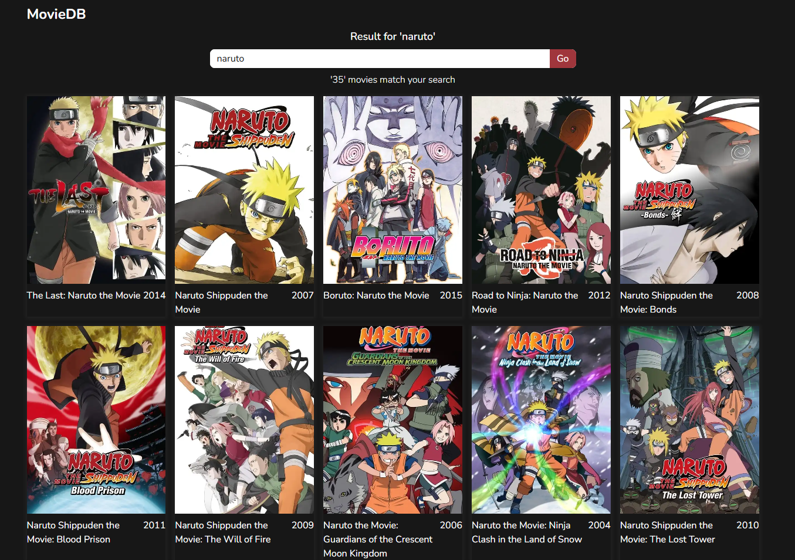
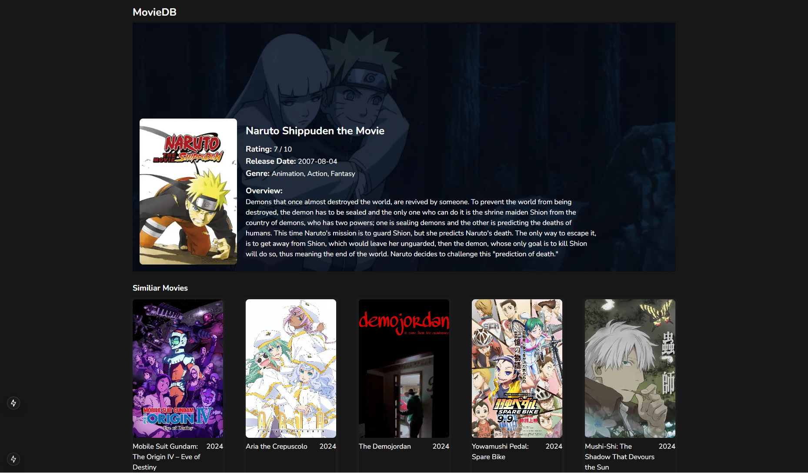

# Movie Search

Your web application allows users to search for movies and displays a list of relevant results. Users can view detailed information for each movie and explore similar movie recommendations on the detail page. The app is designed to be responsive and user-friendly, providing an informative movie search experience.

## Tech Stack

**Client:** Next.js, Tailwind

**Server:** [API MovieDB](https://developer.themoviedb.org/reference/intro/getting-started)

## Demo

https://the-next-movie-db.netlify.app/

## Screenshots




</div>

## Run Locally

Clone the project

```bash
  git clone https://github.com/tiedsandi/project_next_movie_db
```

Go to the project directory

```bash
  cd project_next_movie_db
```

Install dependencies

```bash
  npm install
```

Start the server

```bash
  npm run dev
```

## Environment Variables

To run this project, you will need to add the following environment variables to your **.env.local** file

`MOVIEDB_API_KEY`

# Hi, I'm Fachran! 👋

## 🚀 About Me

I am a web developer based Jakarta, Indonesia. With a passion for continuous learning and growth, I focus on building interactive and responsive user interfaces. I have experience developing web applications using modern technologies like React.js, Redux, and SASS, along with design skills in Figma to ensure both aesthetics and functionality.

## 🛠 Skills

I am proficient in programming languages like JavaScript, as well as front-end technologies such as HTML, CSS, and popular frameworks like Bootstrap. Additionally, I am experienced in integrating Restful APIs to build dynamic, backend-connected applications.

I strive to create innovative, user-friendly solutions and am eager to contribute to dynamic and collaborative development teams.

## 🔗 Links

[](https://fachran-sandi.netlify.app/)
[](https://www.linkedin.com/in/fachransandi/)
